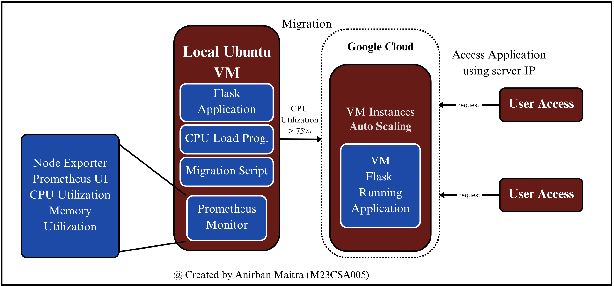

# AutoScale-and-Migration-VCC
Implement resource monitoring using Prometheus and Configure auto-scaling policies on Google Cloud Platform (GCP) to scale resources when CPU utilization exceeds 75%.

### Prometheus is used to monitor CPU and memory utilization on the local VM.
#### Install Prometheus:
- Download and install Prometheus on the local VM.
- Configure Prometheus to scrape metrics from Node Exporter.
  - wget https://github.com/prometheus/prometheus/releases/download/v2.30.3/prometheus-2.30.3.linux-amd64.tar.gz
  - tar -xvzf prometheus-2.30.3.linux-arm64.tar.gz
  - cd prometheus-2.30.3.linux-arm64
  - ./prometheus —config.file=prometheus.yml

#### Install Node Exporter:
- Install Node Exporter to collect system metrics (CPU, memory, disk usage).
  - wget https://github.com/prometheus/node_exporter/releases/download/v1.3.1/node_exporter-1.3.1.linux-amd64.tar.gz
  - tar -xvzf node_exporter-1.3.1.linux-arm64.tar.gz
  - cd node_exporter-1.3.1.linux-arm64
  - ./node_exporter

#### Configure Prometheus:
- Edit prometheus.yml to scrape metrics from Node Exporter:
scrape_configs:
  - job_name: 'node'
    static_configs:
      - targets: ['localhost:9100']
   

A python script that queries CPU utilisation and memory Utilization on Virtual Machine and logs it. Above is the log that shows Increase in CPU utilisation when CPU_Load Program is running and drop in CPU Utilization when the CPU_Load Program is stopped.

### Autoscaling Policy Configuration and Migration
We will use Google Cloud Platform (GCP) for auto-scaling.
Steps:
Create a GCP Account:
Sign up at https://cloud.google.com/.
Set Up a GCP Project:
Create a new project in the GCP Console.
Install Google Cloud SDK:
Install the Google Cloud SDK on the local VM:
  - echo "deb [signed-by=/usr/share/keyrings/cloud.google.gpg] https://packages.cloud.google.com/apt cloud-sdk main" | sudo tee -a /etc/apt/sources.list.d/google-cloud-sdk.list
  - sudo apt-get install apt-transport-https ca-certificates gnupg
  - curl https://packages.cloud.google.com/apt/doc/apt-key.gpg | sudo apt-key --keyring /usr/share/keyrings/cloud.google.gpg add -
  - sudo apt-get update && sudo apt-get install google-cloud-sdk

Authenticate and configure the SDK:
  - gcloud init
